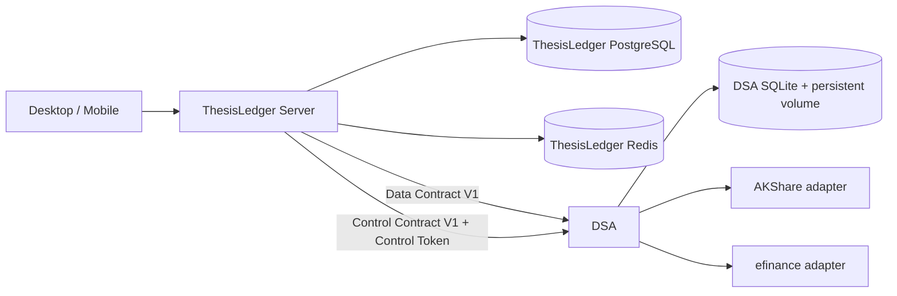

# 市场数据与标的中心 Spec

| 项目 | 内容 |
| --- | --- |
| 版本 | v1.2 |
| 日期 | 2026-08-18 |
| 状态 | Draft |
| 任务标识 | `market-data-provider-v1-2` |
| 关联任务 | [市场数据与标的中心 v1.2 实施任务](../tasks/2026-08-18-market-data-provider-v1-2.md) |
| 适用仓库 | `thesis-ledger`、`daily-stock-analysis`、`thesis-ledger-infra` |

> 本文是需求与领域边界规格，不是实施指令。本次只建立 Spec 和任务文档，不实施代码、迁移、配置、Compose 或 UI。

## 1. 文档定位与输入边界

### 1.1 与 v1.1 的关系

`docs/archive/specs/2026-08-18-market-data-provider-spec-v1.1.md` 是本版本的参考输入和历史 Draft，不是自动执行的指令；它保持原文件不变。v1.2 继承其中仍然有效的兼容约束，并以本 Spec 和用户已确认的决策为准。若 v1.1 的 Provider 路由、Sidecar、数据模型或存储提议与本 Spec 冲突，以本 Spec 为准。

本版本特别固定以下边界：

1. `ProviderConfig` 保持现有职责，不承载市场路由。
2. 新增独立的 `DesiredProviderPolicy`，只表达市场路由意图。
3. `ThesisLedger` 持久化 Desired Policy；DSA 持有 ProviderConfig、Capability、凭证和运行状态，并通过独立、版本化的 Control Contract 校验 Desired Policy、生成 Effective Policy。
4. Desired Policy 与 DSA ProviderConfig/Effective Policy 禁止混用，也不通过共享数据库耦合。

### 1.2 背景与问题

当前 `Asset`、`.OF` 基金标识、行情消费和 DSA Contract V1 已经承担生产数据链路。新增多 Provider 管理时，如果继续把 Provider 配置、凭证、路由偏好和运行健康混在一个模型中，会产生以下问题：

- 用户意图与 DSA 当前可执行状态无法区分；
- 配置凭证、超时、重试、熔断等运行细节会泄漏到主系统；
- Provider 不可用时容易出现未声明的隐式 fallback；
- 标的搜索身份可能被某个 Provider 的原始字段或临时代码绑死；
- 现有 `Asset`、Position、Ledger、估值和 Data Contract V1 需要被不必要地替换。

本 Spec 将市场标的目录、用户期望的 Provider 路由、DSA 的可执行策略和产品数据缓存拆开，同时保留现有生产链路的增量兼容性。

### 1.3 目标

- 建立 Provider-neutral 的 `Instrument` 目录，用于搜索、消歧和新持仓录入。
- 保留 `Asset` 作为 Ledger 的事实模型，继续使用现有 canonical symbol 和 `.OF` 语义。
- 让用户在 ThesisLedger 中持久化可审计的 Desired Provider Policy。
- 让 DSA 独立持有 Provider 适配器、配置、凭证、能力声明、健康和 Effective Policy。
- 通过独立的 Control Contract 管理 Desired 到 Effective 的版本化同步。
- 在 Quote、Daily Bar、Fund NAV 及历史 Fund NAV 上实现有边界、可观测、可测试的 fallback。
- 提供 Desktop 的完整市场数据管理能力，Mobile 只读消费结果。
- 让旧客户端、旧 DSA Data Contract V1 和既有 DSA native analysis 在增量发布期间继续工作。

### 1.4 非目标

- 不替换 `Asset`、Position、Ledger、估值的 canonical symbol 体系。
- 不在 ThesisLedger 中新增 Python Provider Sidecar，也不让 ThesisLedger 或客户端直连 AKShare、efinance 等 Provider。
- 不把市场路由写入现有主系统 `ProviderConfig`，也不把 DSA ProviderConfig 反向持久化到 ThesisLedger。
- 不在 MVP 实现 Tushare、RQData、Custom Provider 的可执行适配器或配置 UI；它们只能作为未来 manifest 项存在。
- 不通过共享 PostgreSQL、共享 SQLite 或 DSA push 代替 Contract 同步。
- 不在一次响应内做字段级跨 Provider 拼接，不把缓存伪装成 Provider。
- 不把 `INSTRUMENT_SEARCH` 作为 DSA Provider 路由；搜索属于 ThesisLedger 的本地产品能力。

## 2. 领域模型与职责边界

### 2.1 核心术语

| 术语 | 定义 | 所属边界 |
| --- | --- | --- |
| `Instrument` | DSA 归一化、Provider-neutral 的市场目录与搜索身份；用于发现、消歧和选择 | ThesisLedger 目录；身份来源为 DSA Catalog Contract |
| `Asset` | Ledger 的事实标的；Position、Ledger、估值继续引用它 | ThesisLedger domain |
| `InstrumentAssetAssociation` | `Instrument` 与 `Asset` 的独立关联，记录状态、来源和时间 | ThesisLedger domain |
| `ProviderConfig` | 现有主系统 Provider 配置，继续服务通知/AI 等既有职责 | ThesisLedger；不得加入市场路由 |
| DSA `ProviderConfig` | DSA 适配器配置、凭证引用、Provider-specific 参数和运行配置 | DSA；与主系统 `ProviderConfig` 不是同一模型 |
| `Capability` | 数据或 Provider 控制能力，例如 `REALTIME_QUOTE`、`DAILY_BAR` | Contract / DSA manifest |
| `InstrumentType` | `STOCK`、`ETF`、`MUTUAL_FUND` 等目录类型 | Shared Schema / Catalog |
| `DesiredProviderPolicy` | 用户在 ThesisLedger 中持久化的路由意图和全局启停状态 | ThesisLedger |
| `EffectiveProviderPolicy` | DSA 基于 Desired Policy、manifest、配置和运行条件生成的可执行投影 | DSA |
| Provider ID | DSA 内 canonical、不可变的标识，例如 `akshare`、`efinance` | DSA Contract |
| Data Contract V1 | DSA 对市场数据消费的现有版本化契约 | ThesisLedger Server ↔ DSA |
| Control Contract | 独立于 Data Contract V1 的 Provider 管理、策略同步和运维契约 | ThesisLedger Server ↔ DSA |
| Catalog generation | 一次完整目录快照及其 delta 的单调版本 | DSA → ThesisLedger |

### 2.2 两层标的模型

`Instrument` 和 `Asset` 是两层模型，不得互相替代：

- `Instrument` 负责目录、搜索、名称展示、类型和市场消歧；它不承载 Ledger 交易事实。
- `Asset` 继续是 Position、Ledger、估值和现有市场数据消费的 canonical 入口。
- 用户选择一个可确认的 `Instrument` 后，必须显式创建或确认对应 `Asset` identity，并写入独立的 `InstrumentAssetAssociation`。
- 关联不是 `Asset` 的派生字段，也不是每次搜索时临时推导；它必须记录 `status`、`source`、关联时间和最近更新时间。
- 既有 Asset 通过当前 `.SH`、`.SZ`、`.BJ`、`.OF` canonical symbol 做确定性 backfill，不重新解析、不静默改绑用户已经确认的 Asset。
- 目录名称变化只在目录层展示与已确认 Asset 名称的 mismatch；不得覆盖已确认 Asset 名称。

`Instrument` 的最小稳定字段包括：

- ThesisLedger 生成的确定性 `instrumentId`；
- Provider-neutral 的 `instrumentType`、`market`、`canonicalCode`；
- 稳定展示名 `displayName`；
- 目录 generation、启用/软停用状态及更新时间。

DSA Catalog Contract 只提供稳定身份和展示所需字段，不向 ThesisLedger 传递 Provider 原始字段、Provider 内部主键或 Provider Mapping。Provider-specific mapping 留在 DSA。

### 2.3 `InstrumentType` 与可用范围

目录可以展示全部以下类型，以便搜索结果完整，但只有 `STOCK`、`ETF`、`MUTUAL_FUND` 可以在 MVP 中确认、持有和估值：

`STOCK`、`ETF`、`MUTUAL_FUND`、`LOF`、`INDEX`、`BOND`、`CONVERTIBLE_BOND`。

`LOF`、`INDEX`、`BOND`、`CONVERTIBLE_BOND` 可以被搜索和展示，但在不支持的场景中必须明确显示 disabled/unsupported，不得建立可持有的 Asset 关联。新持仓录入移除手工 symbol 输入，只允许通过目录搜索选择；目录过期时可使用最近完整 generation，但必须显示 stale 标记。

身份确认不依赖 Quote 或 Fund NAV 是否可用。身份可用性和价格可用性是两个独立状态。

### 2.4 模型分离表

| 模型 | 持久化位置 | 允许承载 | 明确禁止 |
| --- | --- | --- | --- |
| 主系统 `ProviderConfig` | ThesisLedger 既有存储 | 既有通知/AI Provider 配置与凭证语义 | 市场路由、Capability 覆盖、Effective 状态 |
| DSA `ProviderConfig` | DSA SQLite | Provider-specific 参数、凭证、适配器配置和运行参数 | ThesisLedger 用户 Desired Policy、Ledger 事实 |
| `DesiredProviderPolicy` | ThesisLedger PostgreSQL | `Capability + InstrumentType → ordered Provider IDs`、全局 Desired enabled、revision、同步状态和历史 | 凭证、timeout、retry、circuit、Provider 原始配置、实际健康 |
| `EffectiveProviderPolicy` | DSA SQLite，并通过 Control Contract 投影给 ThesisLedger | DSA 校验后的实际可执行 Provider 顺序、来源 revision、eligibility 和原因 | 用户凭证编辑、Ledger 事实、未声明的隐式 Provider |
| Product cache | ThesisLedger Redis/PostgreSQL | 用户可见的 fresh/last-valid/stale 结果、请求诊断 | `provider=CACHE`、伪造实时数据、替代历史存储 |

上述模型即使字段名称相近，也必须保持独立的 aggregate、API、存储和版本边界。

## 3. 三仓架构与所有权



### 3.1 ThesisLedger

ThesisLedger 负责：

- `Asset`、Position、Ledger 及既有 canonical symbol 语义；
- `Instrument`、`InstrumentAssetAssociation`、目录 generation 和本地搜索；
- `DesiredProviderPolicy`、revision history 和同步状态；
- DSA Data Contract/Control Contract Client；
- 产品级 Quote、Fund NAV、Bars cache、single-flight、Redis lock、stale/unavailable 展示语义；
- Desktop 管理 API、Mobile 只读 API 和最终用户错误映射。

ThesisLedger 不负责 Provider 适配器、Provider 原始字段、Provider 凭证解密、Provider-specific health/circuit 或直接网络请求。

### 3.2 DSA

DSA 负责：

- AKShare、efinance 适配器、严格归一化和 Provider Mapping；
- Provider manifest、Capability 覆盖、ProviderConfig、凭证加密与运行时 reload；
- Provider Health、Retry、Circuit、Job Manager 和运行诊断；
- 源目录抓取、合并、去重、快照/delta generation；
- Control Contract 校验 Desired Policy 并生成 Effective Policy；
- 既有 DSA native analysis。Control Contract 的 `consumer=thesis-ledger` 只影响 ThesisLedger consumer namespace，不改变 DSA native analysis 的既有 Provider 优先级和运行链路。

### 3.3 thesis-ledger-infra

基础设施仓负责三仓版本矩阵、镜像/源码 override、Control Token 注入、DSA 数据卷和发布顺序。DSA 使用现有 SQLite 数据目录并增加独立持久卷，例如 `thesis-ledger-dsa-data`；不得与 ThesisLedger PostgreSQL 共享数据文件或数据库表。现有 PostgreSQL/Redis external volume 属于既有数据边界，迁移和清理不得隐式删除。

## 4. Provider 策略模型

### 4.1 DesiredProviderPolicy

`DesiredProviderPolicy` 是 ThesisLedger 的独立用户意图模型。它的语义只限于：

```text
Capability + InstrumentType -> ordered Provider IDs
```

建议的逻辑结构如下，具体数据库字段名可在实施时按现有 Schema 规范落地，但不得改变语义：

```text
DesiredProviderPolicy {
  consumer: "thesis-ledger"
  revision: positive integer
  enabled: boolean
  routes: {
    [Capability]: {
      [InstrumentType]: ProviderId[]
    }
  }
  sync: {
    state: pending | applied | rejected | superseded
    dsaRevision: optional integer
    syncedAt: optional timestamp
    lastError: optional structured error
  }
  createdAt: timestamp
  updatedAt: timestamp
}
```

约束：

- `ProviderId[]` 保留用户排序，单个 route 内不得重复；Provider ID 必须是 DSA canonical immutable ID。
- 空 route 是合法状态，表示当前 Capability + InstrumentType 没有用户选择的 Provider；运行时必须返回明确的 `NO_ELIGIBLE_PROVIDER`，不能偷偷补默认 Provider。
- `enabled=false` 是全局 Desired disabled；它不是 DSA ProviderConfig 的第二个用户启停开关。
- revision 单调递增。相同 revision 的重复提交必须幂等；旧 revision 必须拒绝。回滚必须创建新的 revision 并重新经过 DSA 校验。
- Policy history 追加保存每次完整 Desired revision，不能只保存最后一次 map，以便审计、回滚和解释路由变化。
- Desired Policy 不得包含凭证、Provider endpoint、timeout、retry、circuit、Provider raw mapping、健康状态或 DSA 内部能力实现细节。

### 4.2 DSA ProviderConfig 与 EffectiveProviderPolicy

DSA 的 `ProviderConfig` 只存放 DSA 执行 Provider 所需的信息，包括 Provider-specific 配置、加密凭证引用、适配器 reload 状态和每个 Capability 的运行参数。DSA manifest 声明 Provider 支持哪些 Capability + InstrumentType 组合。

DSA 通过 Control Contract 接收 Desired Policy 后：

1. 校验 Contract version、consumer、revision、schema、Provider ID 唯一性和 route 结构。
2. 校验 Provider ID 是否存在、Capability + InstrumentType 是否由 manifest 声明、route 顺序是否有效。
3. 对未知 Provider、重复 ID、不支持的组合或结构非法的 Policy，整份原子拒绝，保留旧 Effective Policy。
4. 对 Provider 已知但尚未配置、暂时不可用、被 circuit 打开等运行状态，保留用户 Desired 意图，并在 Effective Policy 中暴露 `configured`、`available`、`health`、`circuit` 和原因；运行时只使用当前 eligible Provider。所有 Provider 都不 eligible 时返回 `NO_ELIGIBLE_PROVIDER`。
5. 校验通过后，持久化并生成带 `sourceDesiredRevision` 的 Effective Policy；更新必须原子化，不能出现部分 route 生效。

Effective Policy 是 DSA 的运行投影，不是用户编辑模型。DSA 不得在 Effective Policy 之外增加隐藏 fallback。Provider ID 移除时，主系统必须先从所有 Desired routes 中事务性移除并返回受影响 route diff；随后 DSA 可禁用/清理凭证，但必须保留 canonical ID、历史、健康和 provenance 的 tombstone。

### 4.3 Desired 与 Effective 的同步生命周期

| 场景 | 必须行为 |
| --- | --- |
| DSA 正常 | ThesisLedger 保存 revision 后通过 Control Contract 提交；DSA 返回 applied/rejected 及 Effective 投影 |
| DSA 不可用 | Desired revision 仍可保存为 `pending`；旧 Effective 继续服务；界面展示最后一次 DSA 投影及时间；重连后只应用最新 revision |
| 同 revision 重试 | 幂等返回原结果，不重复改运行时 |
| 旧 revision | 拒绝，不得回退当前 Desired/Effective |
| 显式回滚 | 从历史复制为新的 revision，再经过完整校验和原子应用 |
| Policy 全局 disable | 事务性进入 disabled Effective；不删除历史 routes |
| 空 route | 正常保存和应用；数据请求走 cache/unavailable 语义，不补 Provider |
| 非法或不兼容 route | 整份拒绝，旧 Effective 不变，并返回稳定结构化错误 |

### 4.4 全局 Provider disable

用户在管理界面执行 Provider 的全局 disable/remove 时，操作必须在 ThesisLedger 内完成以下事务：


- 从所有 Desired route 中删除该 Provider ID；
- 记录完整 revision history；
- 返回受影响的 `Capability + InstrumentType` route diff；
- 再通过 Control Contract 通知 DSA 禁用或清理凭证；
- 保留 Provider ID、历史、健康和已返回数据的 provenance tombstone。

不能只在 DSA 端过滤 Provider 后让主系统显示“已保存”，也不能静默丢弃用户配置而不返回 diff。

## 5. Contract 边界

### 5.1 Data Contract V1

现有 Data Contract V1 继续作为数据消费契约，必须保持向后兼容：

- 现有 capabilities、Quote、Daily Bar、Fund NAV、指标和 chip 等路径继续可用；
- 旧客户端不认识 Control Contract 时，仍可消费已有 Data Contract；
- Catalog snapshot/delta 是 Data Contract 的兼容扩展，不改变既有行情字段的含义；
- DSA 不可用或未升级时，主系统不得因此破坏旧的 V1 数据路径，只能进入降级/不可管理状态。

Control Contract 的版本、错误和同步语义不能通过修改 Data Contract V1 的字段来表达。

### 5.2 Control Contract V1

Control Contract 与 Data Contract V1 独立版本化，至少覆盖以下操作：

| 操作 | 方向 | 语义 |
| --- | --- | --- |
| Control handshake/version | ThesisLedger Server ↔ DSA | 协商 Control Contract 版本、consumer namespace 和能力 |
| Provider registry/config projection | DSA → ThesisLedger | 返回 canonical Provider ID、manifest、配置状态和 write-only 展示 |
| Save/test ProviderConfig | ThesisLedger Server → DSA | 原子保存、hot reload 或 ephemeral read-only Smoke Test |
| Apply Desired Policy | ThesisLedger Server → DSA | 传递完整 revision，校验并原子生成 Effective Policy |
| Effective Policy/health | DSA → ThesisLedger | 返回 source revision、eligible 状态、health、circuit 和原因 |
| Trigger/catalog job status | ThesisLedger Server ↔ DSA | 使用同一个 Job Manager 触发或读取目录同步，不重复并发任务 |
| Control diagnostics | DSA → ThesisLedger | 返回稳定错误码、request/diagnostic ID 和可展示诊断 |

Control Contract 的请求 envelope 必须带 `contractVersion`、`consumer`、`requestId`；Policy 操作还必须带 `revision`。只有 ThesisLedger Server 持有独立 Control Token。Desktop、Mobile 和其他客户端不得知道 Control Token，也不得直连 DSA。

### 5.3 Catalog snapshot/delta

DSA 负责从源 Provider 抓取、合并和归一化目录，并向 ThesisLedger 提供版本化的 full snapshot/delta：

- 每个 generation 具有单调版本、完整性标记、checksum 和 cursor；
- DSA 持久化最新完整 snapshot 及有限 delta 窗口；
- ThesisLedger 通过 cursor/generation 拉取并 ACK，失败可重试；
- cursor 已过期时，DSA 返回需要 full snapshot 的稳定错误；
- ThesisLedger 只在完整 snapshot/delta 链成功并校验 checksum 后原子切换 generation；
- 未完成的 generation 不得软停用旧目录；只有完整 snapshot 成功后，缺失条目才可软停用；
- 不使用 DSA push，不共享主系统数据库；
- 定时同步和手工触发均进入同一个 DSA Job Manager，必须去重并发任务。ThesisLedger 只发起触发请求并观察状态。

DSA Catalog Contract 的输出只包括稳定 identity、`displayName`、`InstrumentType`、market 等跨 Provider 字段。ThesisLedger 负责生成 pinyin、pinyin initials 和搜索 aliases。

## 6. Provider 与 Capability

### 6.1 MVP Provider

MVP 只实现并在管理 UI 中展示：

- immutable Provider ID `akshare`；
- immutable Provider ID `efinance`。

Tushare、RQData、Custom 只能作为未来/unsupported manifest 条目，不生成虚假的凭证表单、连接测试或可执行路由。

### 6.2 Capability 边界

MVP 的可执行数据能力为：

- Provider List/Manifest 与 Catalog Sync；
- `REALTIME_QUOTE`；
- `DAILY_BAR`；
- `FUND_NAV`；
- `FUND_NAV_HISTORY`。

`INSTRUMENT_SEARCH` 是 ThesisLedger 本地目录能力，不进入 Provider Policy route matrix。`MINUTE_BAR`、`FUNDAMENTALS` 可以保留在枚举或 Contract 能力表中，但在 MVP manifest 中标记 unsupported，不生成可执行 route。

Policy route matrix 只允许 manifest 声明且 DSA 能执行的 `Capability + InstrumentType` 组合。初始产品预置策略可使用 `akshare` 优先、`efinance` fallback，但仅在首次不存在任何 Desired Policy 时 seed 为 revision 1；后续不能用默认值覆盖用户已有策略。

### 6.3 Provider 配置与凭证

- DSA 凭证使用专用 Secret Key 加密，Secret Key 版本化；轮换采用旧 key 解密、新 key 重加密，失败可回滚。
- DSA 保存配置必须先校验，再原子持久化并 hot reload adapter；失败时旧配置和旧运行实例保持有效。
- 主系统管理页的凭证字段 write-only；编辑时空值表示保留已有凭证，只有显式 clear 才清除。
- Draft Connection Test 不持久化草稿凭证；只有显式 Save 才写入 DSA。
- Test connection 是有界、只读的 Capability Smoke Test：执行 health 检查及声明 Capability 的代表性调用，按 Capability 返回结果，并写入可追踪的手工 health record；不得借测试修改 Desired Policy。

## 7. 目录搜索与身份确认

### 7.1 搜索与排序

ThesisLedger 在 PostgreSQL 中持久化归一化目录，并使用 `pg_trgm` 支持本地搜索。固定排序为：

1. canonical code 完全匹配；
2. canonical code 前缀匹配；
3. name 完全匹配或前缀匹配；
4. pinyin 或 initials 完全匹配或前缀匹配；
5. fuzzy 匹配；
6. 以稳定 key 作为最终 tie-break，保证相同输入结果稳定。

搜索 `000001` 时，股票和基金等不同 `InstrumentType` 必须并列展示，包含类型和 market。Account 上下文可以过滤或排序，但不能静默替用户选中一个类型。

### 7.2 选择与回填

- 新增持仓必须从搜索结果选择 `Instrument`；手工 symbol 入口移除。
- 选择可确认类型后，用户确认生成或关联 `Asset`，来源标记为 `user-confirmed`。
- 既有 `.SH/.SZ/.BJ/.OF` Asset 只做确定性目录关联 backfill；找不到目录时保留 Asset，不得删除或自动改绑。
- 用户已经确认的 Asset identity 不得被后续目录同步静默变更。
- 目录 stale 不阻断身份确认，但必须在 UI 和后续诊断中保留 stale 事实。

## 8. 数据读取、fallback 与缓存

### 8.1 Provider 选择与健康范围

Provider 选择必须使用 DSA 当前 Effective Policy，按用户指定顺序顺序尝试，每个 Provider 对同一 upstream 请求最多一次；不允许在 Effective Policy 外追加 fallback、无限重试或并行风暴。

Health 和 Circuit 的最小隔离范围为：

```text
consumer + Provider + Capability + InstrumentType
```

Provider aggregate health 只能作为展示汇总，不能替代上述隔离维度。

失败分类：

- 网络、timeout、5xx 等 transient failure：执行有限 retry，之后记录 scoped circuit 并尝试下一 Provider；
- Provider 返回有效但不覆盖某个 instrument：在记录级或序列级进入 fallback；
- 输入非法、参数校验失败、明确 unsupported capability：不 retry、不打开 circuit。

DSA 使用每 Provider/Capability 的 bounded 参数；基线为最多 1 次 transient retry，连续 3 次 scoped transient failure 后打开 60 秒，随后允许 1 次 half-open probe。具体 DSA override 属于 DSA ProviderConfig/运行参数，不进入 Desired Policy；任何调整都必须保持有界并可诊断。

### 8.2 批量与序列 fallback

- Quote 和 Fund NAV 批量请求采用 record-level fallback；每条记录的完整结果来自一个 Provider，批量响应可以包含多个 Provider 的记录。
- Daily Bar 和 Fund NAV history 采用 sequence-level fallback；同一条序列一次只选择一个 Provider，不在序列内部混合来源。
- 结果必须严格归一化；无效结果视为 Provider failure 并触发既定 fallback，禁止用默认值填充。
- MVP 不做 live cross-source reconciliation。发现来源差异只进入 diagnostics，不改变用户可见的单源结果。

### 8.3 ThesisLedger 产品缓存

ThesisLedger 产品缓存是用户可见的 fresh/last-valid/stale 语义权威；DSA 可以有短期内部 cache，但不能定义产品 freshness。相同 `Capability + Instrument` 的请求使用 single-flight 和 Redis lock，避免重复上游请求。

- Quote/NAV 的 stale last-valid 可以展示并用于组合估值，但必须明确标记 stale；
- Risk、Backtest、Alert、AI 默认拒绝 stale 或 partial 数据；调用方若要接受必须显式声明；
- 历史 Bars/NAV 只能使用 PostgreSQL 已存的历史记录，不得把最新 Quote/NAV cache 当历史数据；
- 没有 Provider、没有可用缓存或缓存过期时，返回稳定结构化 unavailable error 和 request/diagnostic ID。

### 8.4 现有 wire freshness 与 provenance

保持现有 Schema 的 freshness/time 语义，不新增同义的 `asOf` 时间体系：

- Quote 继续使用 `live | delayed | stale | unknown`、`stale`、`marketTime`、`fetchedAt`；
- Fund NAV 继续使用 `delayed | stale | unavailable`、`navDate`、`fetchedAt`；
- Bars 不新增 freshness 字段；
- UI 的 `FRESH/STALE` 只是上述 wire 状态的展示映射；
- `asOf` 如需展示，映射到 `marketTime` 或 `navDate`，不再创建重复业务时间字段。

Provider provenance 必须保持可解释：

- `provider` 始终是实际 upstream Provider ID，禁止使用 `provider=CACHE`；
- `fallbackUsed=true` 只表示本次实际发生过 Provider 切换；
- cache 来源使用独立的 `servedFromCache`/等价 cache-origin 字段，不能复用 `provider` 或 `fallbackUsed`；
- raw Provider error 只进入日志和 diagnostics，不直接暴露给用户。

## 9. 管理界面与客户端边界

### 9.1 Desktop

Desktop 提供完整的市场数据管理页，范围为 workspace/global，并且与现有 `/providers` 通知/AI ProviderConfig 页面分离。管理页至少包括：

- Provider 列表、manifest Capability、配置状态、health/circuit 和最近诊断；
- Desired route matrix 的本地 draft 编辑、排序、全局启停和一次性 Apply/save；
- 当前 Desired Policy、最后已知 Effective Policy、revision、同步状态和失败原因；
- 目录同步状态、generation、checksum、手工触发入口和任务结果；
- write-only 凭证编辑、显式清除和逐 Capability Connection Test。

DSA 不可用时，页面展示 Desired Policy 和带时间的最后一次 DSA projection，进入只读；保存、测试、同步触发必须 disabled。局部表单修改先留在本地 draft，只有 Apply/save 才产生新的 Desired revision。

### 9.2 Mobile

Mobile 只读消费现有 ThesisLedger API，展示 stale/unavailable 和来源/诊断状态，不提供 Provider 配置、凭证编辑、策略 Apply、Connection Test 或目录同步管理。

### 9.3 权限与敏感信息

客户端永远不直连 DSA，不持有 Control Token，不接收可逆凭证。接口返回配置时只返回是否已配置、更新时间和诊断，不返回 secret 内容。

## 10. 持久化、安全与运行状态

### 10.1 ThesisLedger 存储

主系统 PostgreSQL 需要持久化：

- 归一化 `Instrument` 目录、generation、软停用状态和搜索字段；
- `InstrumentAssetAssociation`；
- `DesiredProviderPolicy` 当前版本和完整 revision history；
- Control 同步状态、最后一次 Effective projection 的可展示摘要和诊断引用；
- 需要支持 stale/历史读取的产品数据及其 provenance。

Redis 用于产品 cache、single-flight 和锁，不作为 Desired Policy 的唯一持久化来源。

### 10.2 DSA 存储

DSA 在现有 `/app/data/stock_analysis.db` SQLite 中持久化 ProviderConfig、加密凭证、Effective Policy、Job、Catalog generation/delta、health/circuit 和 diagnostics，并通过独立持久卷保证重启后恢复。DSA 不写 ThesisLedger PostgreSQL。

### 10.3 配置与 Provider 移除

配置保存必须遵循：验证 → 加密/持久化 → adapter hot reload → 返回新 projection。任一步失败都保留旧配置、旧 adapter 和旧 Effective 运行状态。

Provider removal 必须按 4.4 的 Desired-first 流程执行，并保留 tombstone，以便历史报价、审计和问题诊断继续解释来源。

## 11. 发布、兼容与回滚

### 11.1 发布顺序

采用增量发布：

1. 先升级 DSA 的 Data Contract 扩展、Control Contract、Provider manifest、Catalog 和运行持久化能力；DSA 必须先于主系统升级。
2. 再升级 ThesisLedger 的迁移、目录/策略持久化、Server Client、缓存和兼容映射。
3. 最后升级 Desktop、Mobile 和 infra 的默认镜像/版本矩阵；infra 同时提供 DSA 独立数据卷和 Control Token。

旧 Data Contract V1 必须继续可用。缺少新 Control Contract 时，已有数据消费保持工作，市场数据管理页面显示 degraded，不得假装已经同步或写入成功。DSA native analysis 不因本功能改变。

### 11.2 回滚原则

- 应用回滚不能删除已保存的 Desired Policy history、Catalog generation 或 DSA tombstone。
- Control Contract 新版本失败时，保留最后一个兼容的 Effective Policy 和旧 Data Contract V1 数据路径。
- 数据库迁移必须支持向前兼容或明确的回滚脚本；禁止用删除 volume 的方式回滚。
- DSA Secret Key 轮换保留旧 key 解密能力，直到新 key 下所有凭证完成验证。

## 12. 验收标准

### AC-01 独立策略模型

`ProviderConfig` 没有市场路由语义；`DesiredProviderPolicy` 只包含 route map、Desired enabled、revision/sync/history；DSA ProviderConfig、Effective Policy、凭证和运行状态不被主系统策略模型替代。

### AC-02 Contract 分离

Data Contract V1 继续通过现有客户端工作；Control Contract 独立版本化，使用独立 Control Token，客户端不能直连 DSA。

### AC-03 版本与原子性

Desired revision 单调、latest-wins、幂等；旧 revision 拒绝；非法/不兼容 Policy 整体拒绝且旧 Effective 不变；显式 rollback 生成新 revision。

### AC-04 Provider fallback

只使用 Effective Policy 顺序；无隐藏 fallback；Quote/NAV 可按记录 fallback，Bars/NAV history 按序列 fallback；无字段混合、无限 retry 或 `provider=CACHE`。

### AC-05 目录同步

DSA 能提供完整 snapshot/delta、generation/checksum/cursor；主系统 ACK/retry，过期 cursor 可切回 full snapshot；generation 原子切换，未完成数据不影响上一代目录。

### AC-06 标的身份

Instrument 搜索稳定排序并能展示歧义类型；可确认类型才能建立 Asset 关联；既有 Asset backfill 不重解析、不静默改绑；`.OF` 语义保持不变。

### AC-07 缓存与 freshness

Quote/NAV 使用现有 wire freshness/time 字段；主系统拥有产品 cache 语义；stale 可展示/估值但默认不能进入 Risk/Backtest/Alert/AI；历史数据不从最新 cache 伪造。

### AC-08 凭证与测试

凭证 write-only、空编辑保留、显式 clear 才删除；Connection Test 有界、只读、逐 Capability，并不改变 Desired/Effective 路由。

### AC-09 客户端体验

Desktop 有独立完整管理页，DSA 不可用时显示 Desired 与 last-known projection 并禁用写操作；Mobile 只读；新持仓只能通过目录选择。

### AC-10 持久化与发布

DSA SQLite 有独立持久卷；不共享主数据库；发布顺序为 DSA/Contract → ThesisLedger → Desktop/Infra；旧 V1 和 DSA native analysis 保持可用。

### AC-11 验证证据

Fixture、fault injection、Contract、迁移、API、DSA、Desktop/Mobile、视觉和发布矩阵验证覆盖真实风险路径；受控 AKShare/efinance smoke 作为发布前证据，不作为不稳定的阻断型在线 CI。
